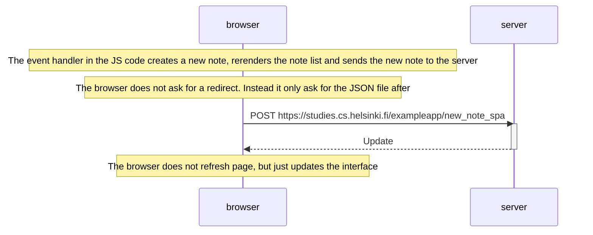

```mermaid
sequenceDiagram
    participant browser
    participant server

    Note over browser: The event handler in the JS code creates a new note, rerenders the note list and sends the new note to the server

    Note over browser: The browser does not ask for a redirect. Instead it only ask for the JSON file after 

    browser->>server: POST https://studies.cs.helsinki.fi/exampleapp/new_note_spa
    activate server
    server-->>browser: Update
    deactivate server

    Note over browser: The browser does not refresh page, but just updates the interface

```    
